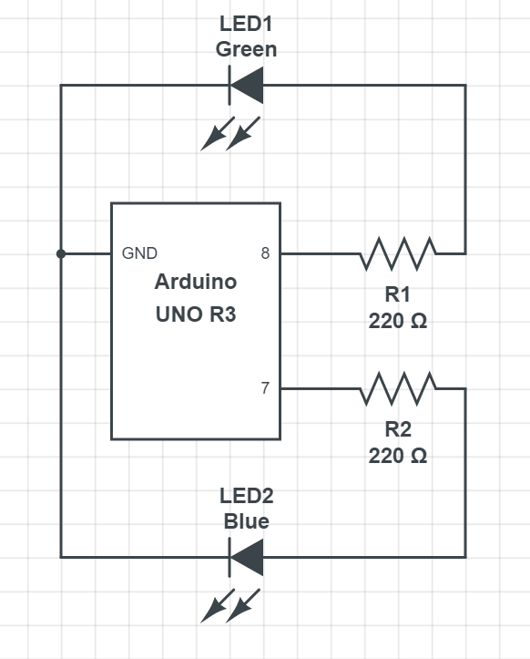

# 3.2-Controlling_Digital_Output
For this assignment you will use what you have learned so far to control two separate circuits with LEDs attached to them.  

### Step One: Build the Prototype

To begin, build this prototype on your breadboard (Instead of connecting the power wires for each circuit to the 5V pin, connect them to pins 7 and 8 as the diagram describes):

After you have completed the prototype you can test your circuits using the 5V pin to make sure they work.

### Step Two: Write the Code

Read [this tutorial on Arduino.cc](https://www.arduino.cc/en/Tutorial/BuiltInExamples/Blink) to learn the concept.  You will be using different pins so you will modify the code they give you.  Instead of calling `digitalWrite(LED_BUILTIN, HIGH)` you will call `digitalWrite(7, HIGH)` to turn on the LED attached to pin 7.

The file `Starter.ino` may be used to help you get started.

Write a sketch in Arduino Create that does the following:
- The green light blinks on for 200 ms and off 200 ms two times.
- There is a one second pause.
- The blue light does the same thing as the green just did.
- There is a three second pause.
- Both lights alternate blinking off and on for 650 ms each. (They continue this forever)

See the video here for guidance.

### Step Three Debug and Submit.

Make sure your prototype behaves the same way as the one in the video.  As in the previous assignment, make a new file here on GitHub.  Name it **3.2_Controlling_Digital_Output** and Commit it to the repository.

**REMEMBER: THIS ASSIGNMENT REQUIRES BOTH A VIDEO OF YOUR PROTOTYPE AND CODE SUBMITTED ON GITHUB**
